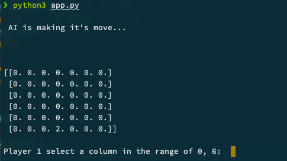
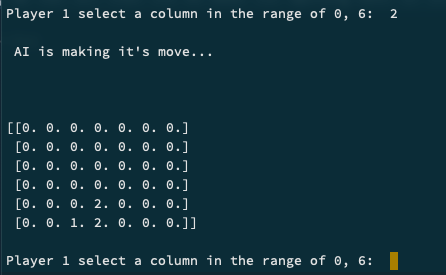
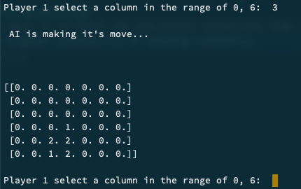
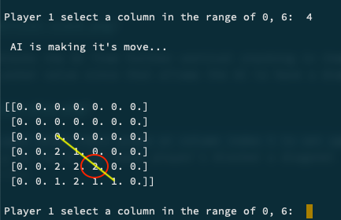
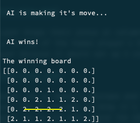
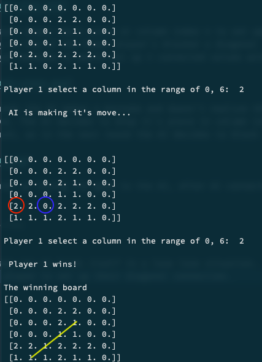

# CS 480/580 - Assignment_4 - Dániel B. Papp

- [How to run](#how-to-run)
- [How it works](#how-it-works)
- [Variables](#variables)
- [Functions](#functions)
  - [General game functionality](#general-game-functionality)
    - [`createBoard()`](#createboard)
    - [`addValueToBoard(board, row, col, value)`](#add-value-to-board)
    - [`isValidMove(board, selection)`](#isvalidmove)
    - [`findOpenRow(board, selection)`](#findopenrow)
    - [`showBoard(board)`](#showboard)
    - [`checkForWin(board, lastValue)`](#checkforwin)
      - [Horizontal check](#horizontal-check)
      - [Vertical check](#vertical-check)
      - [Diagonal with a positive slope check](#diagonal-with-a-positive-slope-check)
      - [Diagonal with a negative slope check](#diagonal-with-a-negative-slope-check)
  - [Advanced game functionality](#advanced-game-functionality)
    - [`evaluateGroup(group, value)`](#evaluategroup)
    - [`scorePosition(board, value)`](#scoreposition)
      - [Horizontal score](#horizontal-score)
      - [Vertical score](#vertical-score)
      - [Diagonal positive slope score](#diagonal-positive-slope-score)
      - [Diagonal negative slope score](#diagonal-negative-slope-score)
    - [`checkTerminalNode(board)`](#checkterminalnode)
    - [`minmax(board, depth, maximizingPlayer)`](#minmax)
    - [`getValidCol(board)`](#getvalidcol)
    - [`pickOptimalMove(board, value)`](#pickoptimalmove)
- [Game flow and logic](#game-flow-and-logic)
- [Analysis](#analysis)
  - [Cases](#cases)

<small><i><a href='http://ecotrust-canada.github.io/markdown-toc/'>Table of contents generated with markdown-toc</a></i></small>

# How to run

```console
python3 app.py
```

# How it works

The connect 4 game is a turn based game. The program kicks off by selecting a random user (AI or human) to go first and then the game continues until one of the players wins or there are no more spaces left on the board.

# Variables

The program comes with initial variables that can be changed to alter the game. The variables are as follows:

_Do note that while some variables can be changed the program won't run the same as we would expect. For example, changing the board size will cause some issues and most likely errors, as the program ins't currently accepting of board sizes different then the basic 7 x 6 board. Variables that can be altered which won't result in a error are underlined in the list below._

- `ROW`
  - This number specifies the number of rows on the board.
  - Default: 6
  - Data type: int
- `COLUMN`
  - This number specifies the number of columns on the board.
  - Default: 7
  - Data type: int
- `HUMAN`, `AI`
  - This number adds a value to the player's turn. This is used to determine if the current player is human or AI.
  - Default: 0 and 1 respectively
  - Data type: int
- `HUMAN_VALUE`, `AI_VALUE`
  - This is the piece that the human player adds to the board. This is used to determine who's piece is on the board. While in regular connect 4 these are described by colors or other symbols, in this game the value was tested using integers. In theory we can change these variables to be a string, but testing wasn't done to see if this would cause any issues.
  - Default: 1 and 2 respectively
  - Data type: int (could accept string with limitations)
- `game_over`
  - This is a boolean value that is used to determine if the game is over or not.
  - Default: False
  - Data type: bool
- <u>`DEPTH`</u>
  - This is the depth of the AI's search. This number represents how many moves ahead the AI will look. The higher the number the more moves ahead the AI will look, but it will also take longer to calculate.
  - Default: 6
  - Data type: int
- `GROUP`
  - This is the number of pieces that must be connected in order to win.
  - Default: 4
  - Data type: int
- `turn`
  - This is the current player's turn. This is used to determine who's turn it is.
  - Default: `random.randint(HUMAN, AI)`
  - Data type: int

# Functions

## General game functionality

### [`createBoard()`](https://github.com/odu-cs-580-f21/assignment_4/blob/107d7cb4df7c999940c27092a35d10df81d5d5fe/app.py#L18)

```python
board = np.zeros((ROW,COL))
return board
```

This function fills in an array of size `ROW` x `COL` with zeros. This is used to create the base board at the beginning of the game.

---

### [`addValueToBoard(board, row, col, value)`](https://github.com/odu-cs-580-f21/assignment_4/blob/107d7cb4df7c999940c27092a35d10df81d5d5fe/app.py#L23)

```python
board[row][col] = value
```

This function adds a value to the board at the specified row and column. The function takes in 4 parameters:

- **board**: The board that the value will be added to.
- **row**: The row that the value will be added to.
- **col**: The column that the value will be added to.
- **value**: The value that will be added to the board.

---

### [`isValidMove(board, selection)`](https://github.com/odu-cs-580-f21/assignment_4/blob/107d7cb4df7c999940c27092a35d10df81d5d5fe/app.py#L27)

```python
return board[ROW - 1][selection] == 0
```

This function checks if the selected column is empty. The function takes in 2 parameters:

- **board**: The board that the value will be added to.
- **selection**: The column that the value will be added to.

---

### [`findOpenRow(board, selection)`](https://github.com/odu-cs-580-f21/assignment_4/blob/107d7cb4df7c999940c27092a35d10df81d5d5fe/app.py#L31)

```python
for val in range(ROW):
    if board[val][selection] == 0:
        return val
```

This function finds the first open row in the selected column. The function takes in 2 parameters:

- **board**: The board that the value will be added to.
- **selection**: The column that the value will be added to.

---

### [`showBoard(board)`](https://github.com/odu-cs-580-f21/assignment_4/blob/107d7cb4df7c999940c27092a35d10df81d5d5fe/app.py#L36)

```python
print(np.flip(board, 0))
```

The purpose of this function is to flip our 2D array horizontally so that the board is displayed correctly. Since our 0,0 coordinate would be top left of the board and we would have to add pieces to the board using complex math, it is easier to just flip the entire board. This function takes in 1 parameter:

- **board**: The board that will be printed to the terminal.

### [`checkForWin(board, lastValue)`](https://github.com/odu-cs-580-f21/assignment_4/blob/107d7cb4df7c999940c27092a35d10df81d5d5fe/app.py#L41)

This is the most complex function that goes into the basic game logic. This function checks if there is a win or not in a selected range. The function takes in 2 parameters:

- **board**: The board that the value will be added to.
- **lastValue**: The value that was inputted by either player last, which will be added to the board.

_For the purpose of visibility, I'll explain what each function does in separate blocks._

#### Horizontal check

```python
for col in range(COL - 3):
    for row in range(ROW):
        if board[row][col] == lastValue and board[row][col + 1] == lastValue and board[row][col + 2] == lastValue and board[row][col + 3] == lastValue:
            return True
```

This section of the code checks for connected values in a horizontal direction. First it loops of all of the columns offset by 3 since no winning connection could be made if either player start off a "winning group" in the index range of 5 -> 7. Then it proceeds to loop over all the rows on the board. If the board contains any 4 connected values in a horizontal direction, the function returns True.

#### Vertical check

```python
for row in range(ROW - 3):
    for col in range(COL):
        if board[row][col] == lastValue and board[row + 1][col] == lastValue and board[row + 2][col] == lastValue and board[row + 3][col] == lastValue:
            return True
```

This section is very similar to the horizontal check function. The only difference is that it offsets the rows by 3 instead of the columns. This is because no winning connection could be made if either player start off a "winning group" in the index range of 4 -> 6. If the board contains any 4 connected values in a vertical direction, the function returns True.

#### Diagonal with a positive slope check

```python
for row in range(ROW - 3):
    for col in range(COL - 3):
        if board[row][col] == lastValue and board[row + 1][col + 1] == lastValue and board[row + 2][col + 2] == lastValue and board[row + 3][col + 3] == lastValue:
            return True
```

This section of the `checkForWin()` function loops over the rows in the board offset by the same 3. It then proceeds to loop over all of the columns in the board offset by the same 3. If the board contains any 4 connected values in a positively sloped diagonal direction, the function returns True.

#### Diagonal with a negative slope check

```python
for row in range(ROW - 3):
    for col in range(3, COL):
        if board[row][col] == lastValue and board[row + 1][col - 1] == lastValue and board[row + 2][col - 2] == lastValue and board[row + 3][col - 3] == lastValue:
            return True
```

This section is very similar to the positive slope check. The only difference is that it searches the columns from index 3 to the end of the column index. This is because no winning connection could be made if either player start off a "winning group" in the index range of 4 -> 6. If the board contains any 4 connected values in a negatively sloped diagonal direction, the function returns True.

---

---

## Advanced game functionality

### [`evaluateGroup(group, value)`](https://github.com/odu-cs-580-f21/assignment_4/blob/107d7cb4df7c999940c27092a35d10df81d5d5fe/app.py#L66)

This function is used to evaluate a group of 4 possibly connected values. This determines the value that the group is worth. The higher the score we assign to a group, the more likely that the AI will peruse that group. The function takes in 2 parameters:

- **group**: The group that will be evaluated for it's score based on board position, and values filled in the group.
- **value**: The value that will be added to the board.

#### Sections of the evaluate function

```python
score = 0
temp_value = HUMAN_VALUE
if value == HUMAN_VALUE:
    temp_value = AI_VALUE
```

This section of the code is used to switch fromm a human player to an AI player. The reason for this is because the human player will not benefit from the evaluation of a winning group, as that is the AI's job.

```python
if group.count(value) == GROUP:
    score += 100
elif group.count(value) == GROUP - 1 and group.count(0) == 1:
    score += 5
elif group.count(value) == GROUP - 2 and group.count(0) == 2:
    score += 2

if group.count(temp_value) == GROUP - 1 and group.count(0) == 1:
    score -= 4

return score
```

This section of the function is used to evaluate the score of a group. The score is determined by the number of values in the group, and the number of empty spaces in the group. The score is then returned. If the group has a 4 in a row, the score is increased by 100. If the group has a 3 in a row, the score is increased by 5. If the group has a 2 in a row, the score is increased by 2. If the group has a 3 in a row for the AI, the score is decreased by 4.

### [`scorePosition(board, value)`](https://github.com/odu-cs-580-f21/assignment_4/blob/107d7cb4df7c999940c27092a35d10df81d5d5fe/app.py#L84)

The purpose of this function is to call the evaluateGroup() function on each group of 4 connected values. The function takes in 2 parameters:

- **board**: The board that will be evaluated.
- **value**: The value that will be added to the board.

The first part of this function sets up a center column preference for the AI. The reason behind this is because there is a higher probability that we connect 4 in a row if we start from the center column. The function then proceeds to loop over all the rows and the columns in the board. For each group of 4 connected values, the function calls the evaluateGroup() function which will score the group with it's containing values.

```python
score = 0

middle_array = [int(i) for i in list(board[:, COL // 2])]
middle_value = middle_array.count(value)
score += middle_value * 3

for row in range(ROW):
    row_array = [int(i) for i in list(board[row, :])]
    for col in range(COL - 3):
        group = row_array[col:col + GROUP]
        score += evaluateGroup(group, value)
for col in range(COL):
    col_array = [int(i) for i in list(board[:, col])]
    for row in range(ROW - 3):
        group = col_array[row:row + GROUP]
        score += evaluateGroup(group, value)
for row in range(ROW - 3):
    for col in range(COL - 3):
        group = [board[row + i][col + i] for i in range(GROUP)]
        score += evaluateGroup(group, value)
for row in range(ROW - 3):
    for col in range(COL - 3):
        group = [board[row + 3 - i][col + i] for i in range(GROUP)]
        score += evaluateGroup(group, value)
return score
```

### [`checkTerminalNode(board)`](https://github.com/odu-cs-580-f21/assignment_4/blob/107d7cb4df7c999940c27092a35d10df81d5d5fe/app.py#L121)

The purpose of this function is for the AI to check if the path that it is choosing is going to lead to a terminal node. The function takes in 1 parameter:

- **board**: The board being passed in is a temporary board that the AI is planning with.

```python
return checkForWin(board, HUMAN_VALUE) or checkForWin(board, AI_VALUE) or len(getValidCol(board)) == 0
```

### [`minmax(board, depth, maximizingPlayer)`](https://github.com/odu-cs-580-f21/assignment_4/blob/107d7cb4df7c999940c27092a35d10df81d5d5fe/app.py#L125)

This function uses the minimax algorithm to determine the best move for the AI. While the requirements specified that Alpha, Beta pruning is to be added as well, it caused some issues with the choice that the AI made when dropping their pieces on the board. The minimax algorithm is implemented and is working as expected without Alpha, Beta pruning implemented. The function takes in 3 parameters:

- **board**: The board that the AI is planning on dropping their piece on.
- **depth**: The depth of the node tree that the AI is looking at. This means that the AI will look `depth` number of moves ahead.
- **maximizingPlayer**: A boolean value which determines if the AI is the maximizing player or the minimizing player.

We start the function by checking if our AI search depth is 0 or if the AI's search resulted in a terminal node. If either of these conditions are met, we return a tuple with None and the score of the board. If neither of the conditions are met, we then check if the `maximizingPlayer` is true or false.

- If it is true,
  - We create a negative infinity score and choose a column randomly within the valid ranges. We proceed by looping over all the columns in the valid range, find open spaces on the board, create a temporary board, and drop a piece on the temporary board. We then create a new score by recursively calling the `minmanx()` function. We then check if the planned score after depth search is greater then our current board score. If it is, we update our board score to the planned score and mark the current column as the best column to drop a piece into. We then return the best column to drop a piece into and the score of the board.
- If it is false,
  - We create a positive infinity score and choose a column randomly within the valid ranges. We proceed by looping over all the columns in the valid range, find open spaces on the board, create a temporary board, and drop a piece on the temporary board. We then create a new score by recursively calling the `minmanx()` function. We then check if the planned score after depth search is less then our current board score. If it is, we update our board score to the planned score and mark the current column as the best column to drop a piece into. We then return the best column to drop a piece into and the score of the board.

```python
valid = getValidCol(board)
isTerminal = checkTerminalNode(board)

if depth == 0 or isTerminal:
    if isTerminal:
        if checkForWin(board, AI_VALUE):
            return (None, 1000000000)
        elif checkForWin(board, HUMAN_VALUE):
            return (None, -1000000000)
        else:
            return (None, 0)
    else:
        return (None, scorePosition(board, AI_VALUE))

if maximizingPlayer:
    value = -math.inf
    best_col = random.choice(valid)
    for col in valid:
        row = findOpenRow(board, col)
        temp_board = board.copy()
        addValueToBoard(temp_board, row, col, AI_VALUE)
        new_score = minmax(temp_board, depth - 1, False)[1]
        if new_score > value:
            value = new_score
            best_col = col
    return best_col, new_score

else:
    value = math.inf
    best_col = random.choice(valid)
    for col in valid:
        row = findOpenRow(board, col)
        temp_board = board.copy()
        addValueToBoard(temp_board, row, col, HUMAN_VALUE)
        new_score = minmax(temp_board, depth - 1, True)[1]
        if new_score < value:
            value = new_score
            best_col = col
    return best_col, new_score
```

### [`getValidCol(board)`](https://github.com/odu-cs-580-f21/assignment_4/blob/107d7cb4df7c999940c27092a35d10df81d5d5fe/app.py#L173)

The purpose of this function is for the AI to determine if the move they are planning on making is a valid move. The function takes in 1 parameter:

- **board**: The temporary board that the AI is planning on dropping their piece on.

The function loops over all the columns in the temporary board and checks if there are any open spaces. If there are, we check if it is a valid move and if that returns true, we append the valid columns into empty array. If there are no open spaces, we return an empty list.

```python
valid_cols = []
for col in range(COL):
    if isValidMove(board, col):
        valid_cols.append(col)
return valid_cols
```

### [`pickOptimalMove(board, value)`](https://github.com/odu-cs-580-f21/assignment_4/blob/107d7cb4df7c999940c27092a35d10df81d5d5fe/app.py#L181)

The purpose of this function is for the AI to pick the best move to make. This function isn't used in the final program as the `minmax()` function handles this functionality and more for the AI. The function takes in 2 parameters:

- **board**: The board that the AI is planning on dropping their piece on.
- **value**: The value that the AI is planning on dropping their piece on.

```python
valid = getValidCol(board)
optimal_score = 0
optimal_col = random.choice(valid)

for col in valid:
    row = findOpenRow(board, col)
    temp_board = board.copy()
    addValueToBoard(temp_board, row, col, value)
    score = scorePosition(temp_board, value)
    if score > optimal_score:
        optimal_score = score
        optimal_col = col

return optimal_col
```

# Game flow and logic

The game launches by creating an empty board and then checking if the `game_over` flag is true. While it is **not** true, the game continues.

We check if the current turn is for human player or the AI. If it is the human we prompt them to enter a column to drop their piece into between the valid ranges of 0 -> 6. We convert their input to an integer for safety and validity and proceed by checking if the move they are trying to make is a valid one. If it is, we select the row based on how many values in the column and row are taken up, and the value on the top of the stack. If this was a winning move, we print that the human player won and end the game. If it is not a winning move, we increase the turn by 1 and switch it to the AI's turn.

The AI then calls the `minmax()` function and decides it's most optimal move based on the depth of search and other parameters described in the above sections. If the move the AI is trying to make is a valid one, we find the highest row to drop their piece into, in the column that they selected in the `minmax()` function. We then drop their piece into the board and check if the game is over. If it is, we print that the AI won and end the game. If it is not, we increase the turn by 1 and switch it to the human player's turn.

At the end of the game we print the winning board.

```python
board = createBoard()

while not game_over:
    if turn == HUMAN:
        select = int(input("\nPlayer 1 select a column in the range of 0, 6:\t"))
        if isValidMove(board, select):
            row = findOpenRow(board, select)
            addValueToBoard(board, row, select, HUMAN_VALUE)

            if checkForWin(board, HUMAN_VALUE):
                print('\n',"Player 1 wins!", '\n')
                game_over = True
                break

            turn += 1
            turn = turn % 2

    if turn == AI:
        print('\n',"AI is making it's move...", '\n')
        select = minmax(board, DEPTH, True)[0]
        if isValidMove(board, select):
            row = findOpenRow(board, select)
            addValueToBoard(board, row, select, AI_VALUE)

            if checkForWin(board, AI_VALUE):
                print('\n',"AI wins!", '\n')
                game_over = True
                break

            turn += 1
            turn = turn % 2

    print('\n')
    showBoard(board)

print('The winning board')
showBoard(board)
```

# Analysis

In the cases shown below we can clearly see that the AI is capable of predicting what the human player is trying to set up. The AI is smart enough to block the human player's winning moves no matter what direction they are trying to connect and also to make the best move possible which ensures it's victory.

## Cases

_The following cases were completed using a `DEPTH` setting of 6._

### Case 1:

In the first case, we can see that the AI made the opening move in the middle column due to our middle column preference score.


The player's first move is to block the horizontal connection from the left side of the board. The AI then decides to stack values vertically since that has the highest possibility of winning currently.



After the player blocks the AI from further vertical stacking in the middle column, the AI then decides to place a value horizontally on top of the player's blocker value since that allows the AI to have a diagonal connection possibility as well as a horizontal.



After the human player drops their piece at column index 4 to set up a negatively sloped diagonal connection, the AI then decides to stack values horizontally on top of the human player's blocker a diagonal connection. The AI also had the incentive to block the diagonal connection from the human player because it would set up 3 connected values with a round winning move possibly within 1 depth.



In the next few rounds the AI makes a mistake and doesn't realize that the human has a winning move within 2 depth unless it blocks the human's winning move. The AI decides to drop it's piece in column index 0. While this was a mistake on the AI's part, it didn't affect the play of the game much, as in the next round the AI decides to block the diagonal connection from the human player.



The human player ends up losing the game to the AI, after AI connects 4 values horizontally. The AI successfully beat the human player in 8 moves.

### Case 2:

In the following game the AI makes another mistake. It decides to drop a piece into column index 0 to stop vertical stacking by the human. While this is a threat, the AI should have been able to identify that the player had to make a single move in order to win the game. By leaving the column index 2 exposed, the human player set up their own stack to connect 4 diagonally.


